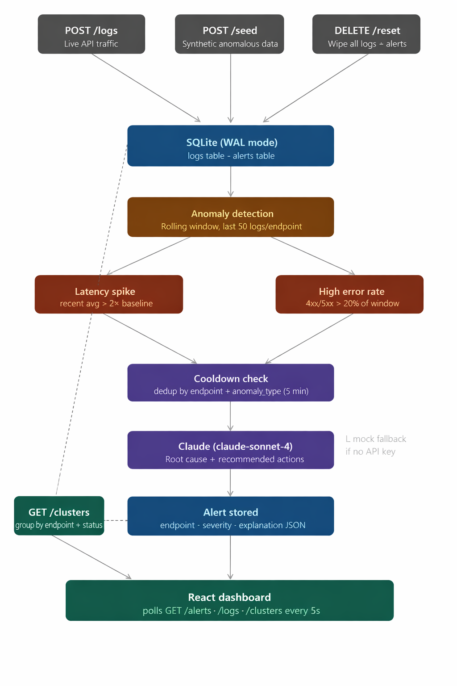
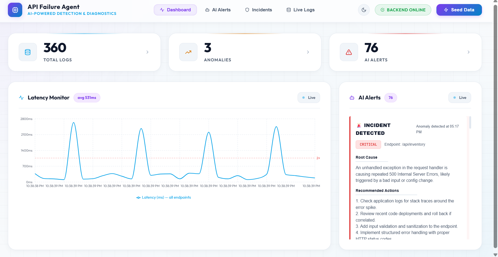
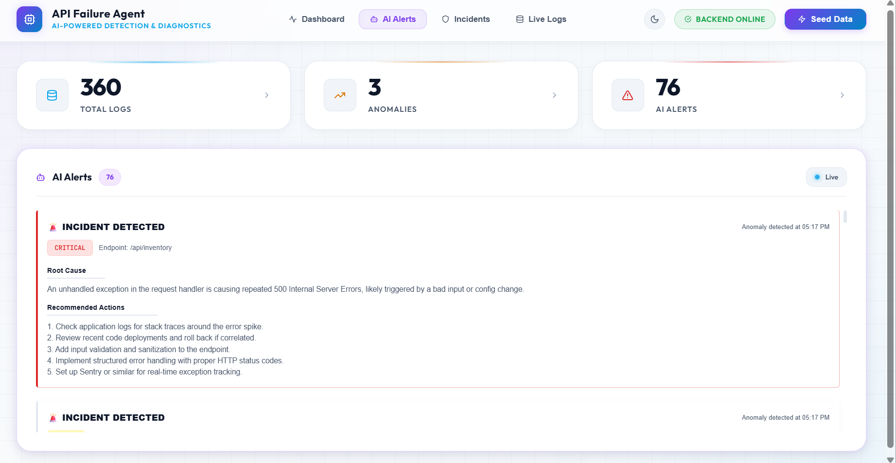
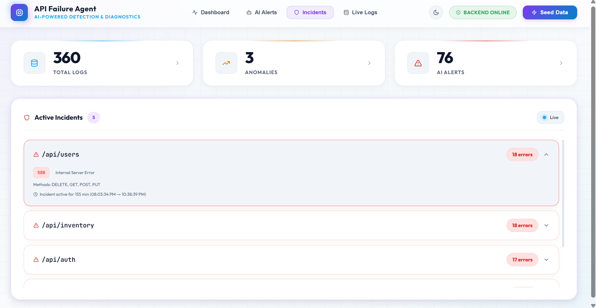
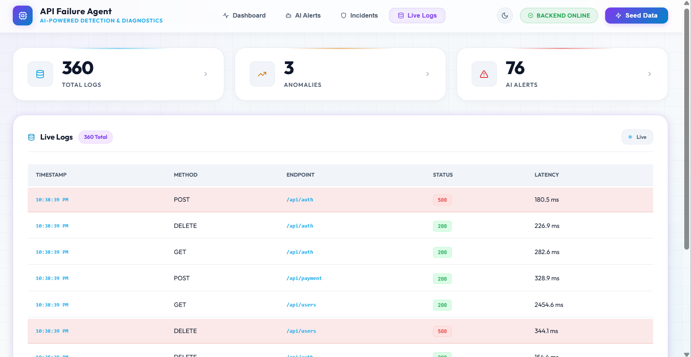

# API Failure Agent

## Overview

The API Failure Agent is a real-time monitoring and debugging tool designed to detect, cluster, and analyze API failures. It automatically ingresses traffic logs, detects latency spikes and HTTP errors, and uses AI to generate actionable alerts. This drastically reduces the time engineers spend debugging complex, distributed API failures by instantly pointing to the root cause.

This tool is ideal for backend engineers, DevOps teams, and SREs who want intelligent observability with minimal setup.

## Features

- **Real-time Log Ingestion:** Fast, low-latency API traffic logging.
- **AI-Powered Anomaly Detection:** Automatically identifies latency spikes, elevated error rates, and anomalous traffic patterns.
- **Intelligent Alerting:** Uses LLMs to generate human-readable explanations of failures and recommended fixes.
- **Incident Clustering:** Automatically groups related failures (e.g., same endpoint and status code) into unified active incidents.
- **Modern Dashboard:** A sleek, fully responsive React interface featuring interactive charts, expandable incident cards, and live log pagination.
- **Day/Night Mode:** Built-in theme toggling for the dashboard.
- **Demo Ready:** Includes a `/seed` endpoint to instantly inject synthetic traffic and anomalies for demonstrations.

## Screenshots

### Application Flow


### Dashboard Overview


### AI Alerts


### Active Incidents


### Live Logs


## Tech Stack

- **Frontend:** React, Vite, CSS (Custom Design System, Fully Responsive)
- **Backend:** Python, FastAPI
- **Database:** SQLite (Zero-configuration)
- **AI Integration:** LLM for root cause analysis

## Installation

### 1. Clone the Repository
```bash
git clone https://github.com/yourusername/api-failure-agent.git
cd api-failure-agent
```

### 2. Backend Setup
```bash
cd app
python -m venv venv
source venv/bin/activate  # On Windows: venv\Scripts\activate
pip install -r requirements.txt
```

### 3. Frontend Setup
```bash
cd ../dashboard
npm install
```

### 4. Environment Variables
Create a `.env` file in the root of the `app` directory for your AI provider keys (if applicable):
```env
# Example environment variables
# OPENAI_API_KEY=your_api_key_here
```

### 5. Run the Application
Start the backend server (from the root directory):
```bash
python -m uvicorn app.main:app --reload 
```

Start the frontend dashboard:
```bash
cd dashboard
npm run dev
```
The dashboard will be available at `http://localhost:5173`.

## Usage

1. Open the dashboard in your browser.
2. Click the **Seed Data** button in the header to inject synthetic API traffic.
3. Watch the dashboard populate with live logs.
4. Navigate to the **AI Alerts** or **Incidents** tabs to view the anomalies detected in real-time.
5. Expand individual incidents to see detailed metrics and AI-generated debugging recommendations.
6. To restart your testing, send a `DELETE` request to `http://localhost:8000/reset` to wipe the database.

## Project Structure

```text
api-failure-agent/
├── app/                  # Python FastAPI Backend
│   ├── main.py           # API Routes
│   ├── db.py             # SQLite Database Logic
│   ├── anomaly.py        # Anomaly Detection Algorithms
│   ├── cluster.py        # Incident Clustering Logic
│   └── llm.py            # AI Alert Generation
├── dashboard/            # React/Vite Frontend
│   ├── src/
│   │   ├── components/   # React Components (LogsTable, IncidentView, etc.)
│   │   ├── App.jsx       # Main Dashboard Layout
│   │   └── index.css     # Design System & Responsive CSS
├── assets/               # README Images
├── .gitignore            # Git ignore rules
├── LICENSE               # MIT License
└── README.md             # Project Documentation
```

## API

- `POST /logs` - Ingest a new API log entry.
- `GET /logs` - Fetch the most recent 1000 logs.
- `GET /alerts` - Fetch active AI-generated alerts.
- `GET /clusters` - Fetch aggregated incident clusters.
- `POST /seed` - Inject synthetic data and trigger anomaly generation.
- `DELETE /reset` - Wipes the database for a clean state.
- `GET /health` - Service health check.

## Configuration

No extensive configuration is required to run the agent locally. Ensure that your frontend is running on a port permitted by the backend's CORS settings (default allows all origins `*` for easy demoing).

## Future Improvements

- Support for external PostgreSQL/MySQL databases for high-scale ingestion.
- WebHook integrations (Slack, PagerDuty) for real-time alert notifications.
- Custom anomaly threshold configurations via the UI.
- Support for distributed tracing (OpenTelemetry integration).

## License

This project is licensed under the MIT License - see the [LICENSE](LICENSE) file for details.
